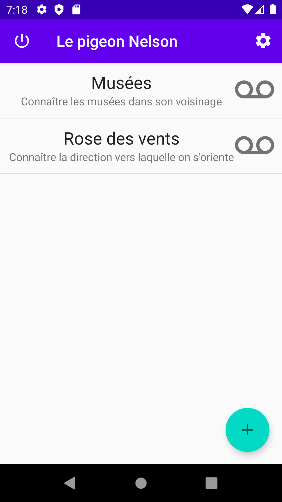
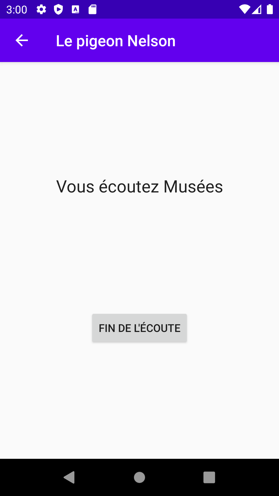

# Le pigeon Nelson : contextual sound broadcasting application

The aim of *le pigeon Nelson* is to provide a sound broadcasting tool according to your location and movement.

See [a french description](https://compas.limos.fr/le-pigeon-nelson/) in Compas website.

## How it works

The application is configurable to choose the reference server from which it will collect the messages to be broadcast, as well as fine-tuning its behavior.

When it is active, the application collects at regular intervals the location, orientation and movement of the user, then consults a reference server with this information (possibly augmented with some information provided by the interface). 

The server then returns a set of broadcastable messages, each of them provided with an associated broadcast guard. These messages are kept by the application, which regularly consults all the broadcastable messages. When it finds that it is in a state that allows the message to be broadcast (location, orientation, expected speed), it broadcasts the message.

This message can be the url of an audio file to be played, or a text that will be said by the application's voice synthesis. 
The application can be set so that the messages can be cut, superimposed, or wait for other messages to be played before being broadcast. Messages can also contain these broadcast constraints.

Servers can be self described, containing their own information (name, description, refresh frequency, etc.).

See [technical notes](technical-notes.md)  and [protocol details](protocol-details.md) if you're interested in technical details.

## Examples of use

* Propose an audio-recorded tour of a neighborhood. The user is free to move around, and messages are triggered according to the constraints defined by the designers of the experience, who will have described this information on the server consulted.
* Offer on-demand information on the services available in the area (e.g. [museums](https://github.com/jmtrivial/le-pigeon-nelson/blob/master/servers/museums.php))
* Play selected music according to the location of the listener

## Development tools

* A [simulator](https://jmtrivial.github.io/le-pigeon-nelson/tools/simulator.html) as been developped as a tool to help during server development. It is a web interface that simulates the application, and build an URL address with parameters to visualize the server answer.
* A [logger server](https://github.com/jmtrivial/le-pigeon-nelson/tree/master/servers/logger) as been developped and a running instance is available (both [server for the application](https://lepigeonnelson.jmfavreau.info/dev/log.php) and [a browser on the logged data](https://lepigeonnelson.jmfavreau.info/dev/logs/browse.php)) to log the collected data, and browse the result.

## License

This project is [provided under GPL v3](./LICENSE).

## Authors

The initial idea has been discussed on August 2020 between Samuel Braikeh and Jean-Marie Favreau.

## About the name of the project

Imagine for a moment a pigeon singing *On the rrrrrroad again* (Willie Nelson). That's it.

## Screenshots

### Server list and broadcast panel

 

### Add a new server

 
 

### Edit a known server

